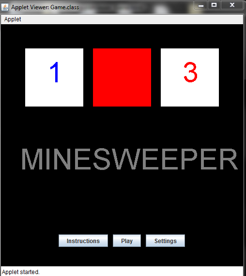
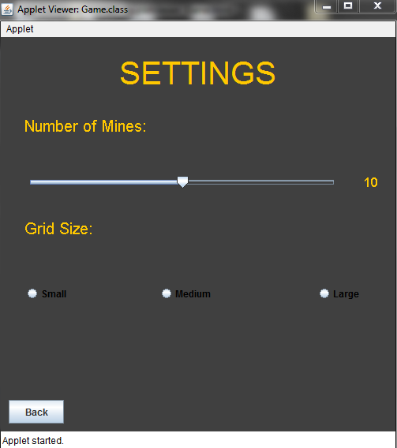
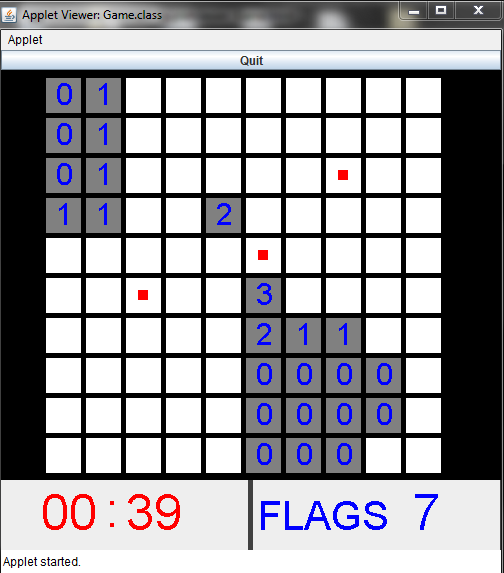

# Minesweeper
 High school Java project using JApplet. Used to use appletviewer (deprecated with no replacement) to open the HTML file:
 
 
 
 The settings panel is used to change the number of mines or the size of the grid:
 
 
 
 Once you press play, it will start the game: 
 
 
 
 If you hit a mine, the applet will take you to a question panel. If you answer the question correctly, you can continue your game. If not, you lose.
